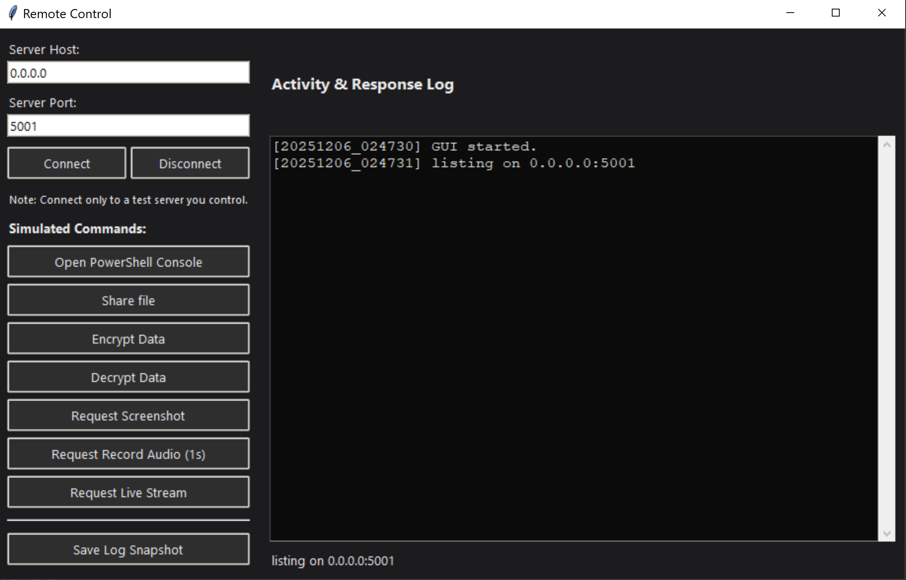
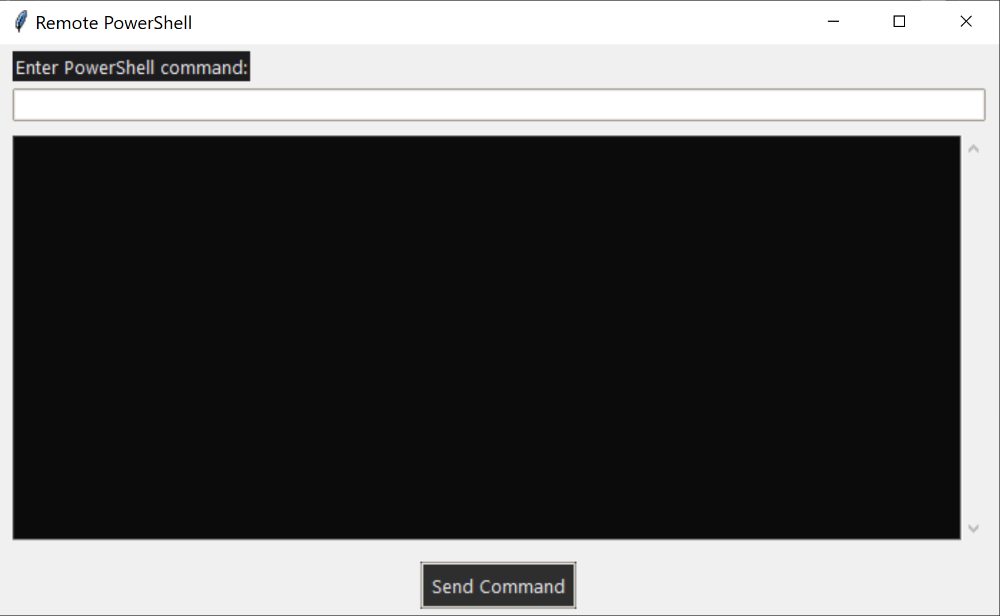

REMOTE CONTROL SIMULATION TOOL README

Introduction
This project is a Python-based simulation of a remote control and remote command execution tool. It includes a server control panel and a client agent program. The tool is designed for cybersecurity learning and demonstrates how devices communicate over networks using sockets.

Overview
The system has two main components:

1. Control Panel (Server GUI) – A graphical interface that sends commands and receives results.
2. Client Agent – Installed on the target device, executes commands and sends back the output.

Objectives

* Teach how remote administration tools operate.
* Demonstrate socket communication.
* Explain how multimedia (audio, screenshots, streaming) is captured.
* Show how data can be transmitted efficiently and safely.

Environment and Libraries Used
This tool uses Python and the following libraries:
os, sys, socket, threading, json, time, tkinter, base64, cv2, numpy, sounddevice, soundfile, pyautogui, subprocess, io

System Structure
Server Control Panel
The server GUI built using Tkinter communicates with the client via TCP sockets.

Imported Libraries and Their Purposes

* tkinter, ttk, ScrolledText: GUI creation
* socket: TCP communication
* json: Handling JSON messages
* threading: Prevent GUI freezing during network operations
* cv2: Processing image and video frames
* base64: Encoding and decoding media
* numpy: Frame handling
* time, datetime: Logging and timestamps
* os, sys: Directory and file management

Important Functions in Server
on_connect
Creates a socket channel and starts listening for client connections.

listen_loop
Responsible for receiving JSON responses from the client including:

* PowerShell output
* Audio
* Screenshot
* Live video stream
* Encryption responses
* Path details and other outputs

log
Writes detailed event logs with timestamps.

send_json_command
Sends commands such as screenshot, audio, video, encryption. The function sends:

1. The length of data
2. The JSON message

cmd_powershell
Creates an interactive window for sending PowerShell commands such as:
dir
cd Desktop
ipconfig

PowerShell Tag Image

Media Commands
cmd_live_stream, cmd_record_audio, cmd_screenshot
Send predefined commands to the client for execution.

Server Features

* Modern dark-themed GUI
* Real-time logging
* Remote PowerShell execution
* Screenshot, audio, and live video receiving
* Result storage inside the Result directory
* Multi-threaded operations

Client Agent Program
The client program connects to the server and executes incoming commands.

Libraries Used in Client
Socket – Server communication
Subprocess – Executes system commands
base64 – Encodes media
pyautogui – Captures screenshots
cv2 – Handles video frames
numpy – Manipulates arrays
sounddevice, soundfile – Audio recording
os, time, datetime – Utility operations

Main Client Functions
client_loop
Continuously receives JSON commands, identifies type, and runs handler functions.

handle_screenshot
Captures a screenshot, converts to PNG, encodes to Base64, and sends to server.

handle_record_audio
Records microphone input, saves WAV, converts to Base64, and returns data.

handle_live_screen
Captures screen continuously, converts to JPEG, and sends frames to server at ~10 FPS.

handle_powershell
Executes system commands such as:
cd folder
dir
mkdir test
python script.py
Tracks and updates current working directory.

Tool Features Summary
Server Side

* Remote PowerShell console
* Screenshot capture
* Audio recording
* Real-time screen streaming
* Logging system
* Automatic result saving

Client Side

* Command execution
* JSON-structured responses
* HD screenshot capturing
* Audio recording
* Real-time streaming

Workflow Scenario

1. The server starts listening on a chosen IP and port.
2. The client connects to the server.
3. A communication channel is created.
4. The server sends a command.
5. The client receives the command and identifies its type.
6. The client executes the command.
7. The client sends the result back.
8. The server stores the output inside the Result folder.
